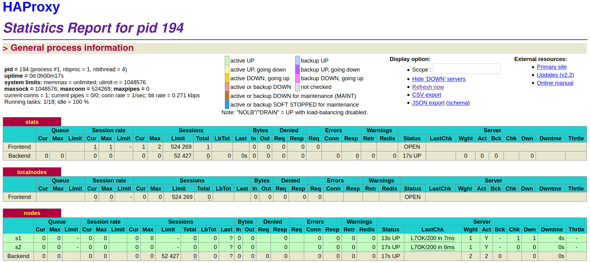

# AIT2020 - Labo-Docker

```
Authors:
  Sacha Perdrizat
  Moïn Danai
  Alban Favre
```

### Introduction
In this lab we will dive in the Loadbalancing with an dynamique containers infrastructure.

### Task 0

[M1] Do you think we can use the current solution for a production environment? What are the main problems when deploying it in a production environment?

[M2] Describe what you need to do to add new webapp container to the infrastructure. Give the exact steps of what you have to do without modifiying the way the things are done. Hint: You probably have to modify some configuration and script files in a Docker image.

[M3] Based on your previous answers, you have detected some issues in the current solution. Now propose a better approach at a high level.

[M4] You probably noticed that the list of web application nodes is hardcoded in the load balancer configuration. How can we manage the web app nodes in a more dynamic fashion?

[M5] In the physical or virtual machines of a typical infrastructure we tend to have not only one main process (like the web server or the load balancer) running, but a few additional processes on the side to perform management tasks.

For example to monitor the distributed system as a whole it is common to collect in one centralized place all the logs produced by the different machines. Therefore we need a process running on each machine that will forward the logs to the central place. (We could also imagine a central tool that reaches out to each machine to gather the logs. That's a push vs. pull problem.) It is quite common to see a push mechanism used for this kind of task.

Do you think our current solution is able to run additional management processes beside the main web server / load balancer process in a container? If no, what is missing / required to reach the goal? If yes, how to proceed to run for example a log forwarding process?

[M6] In our current solution, although the load balancer configuration is changing dynamically, it doesn't follow dynamically the configuration of our distributed system when web servers are added or removed. If we take a closer look at the run.sh script, we see two calls to sed which will replace two lines in the haproxy.cfg configuration file just before we start haproxy. You clearly see that the configuration file has two lines and the script will replace these two lines.

What happens if we add more web server nodes? Do you think it is really dynamic? It's far away from being a dynamic configuration. Can you propose a solution to solve this?


- **[M1]**
No, Because we can't manage manually the failure of the containers (with 2 it is ok but with more than 1k services it will be complicated)
- **[M2]**
We need to:
   - add a new entry in the ``.env`` file
   - add the new entry in the ``haproxy.cfg``
   - create the new container with the right ip address

- **[M3]**
We can use a dynamic solution to detect the configuration of our containers and transmit it to our loadbalancer.

- **[M4]**
On of our container can speak to the others for retrieving their configuration.

- **[M5]**
It is reasonable to add one container that will receive logs and process them, such as a Sentry server. Then, we would need to change the code with which each webapp container is launched so that event logs are forwared to Sentry. That way, we have a centralized log mechanism.

- **[M6]**
One approach would be to set a given number of servers for a backend, say 10, and use resolvers instead of hard-coded IP addresses.

```
server s1 app1.domain.com:80 check resolvers mydns
```

That way, we can assign any number of real backend servers for HAProxy to use through DNS update which, given a short TTL and HAProxy timeout, could mean a practically instantaneous switch.

**Delivrable**

The page ``192.168.42.42:1936``


The URL of our Repository is :
https://github.com/Sinyks/Teaching-HEIGVD-AIT-2020-Labo-Docker

### Task 1


**Deliverables**:

1. Take a screenshot of the stats page of HAProxy at <http://192.168.42.42:1936>. You should see your backend nodes. It should be really similar to the screenshot of the previous task.

**We can see the stat page**


2. Describe your difficulties for this task and your understanding of what is happening during this task. Explain in your own words why are we installing a process supervisor. Do not hesitate to do more research and to find more articles on that topic to illustrate the problem.

For this task we faced a problem mentioned in **M5**, that our container can only do one thing (in our case run a webserver) In our case if we want to have more than one process run by a container it is required to do a little trick, we have installed a process supervisor called ``s6`` to run for now only our application in the container

the point of view of ``s6`` team for the docker way are formulated like this:

- Containers should do one **thing**
- Containers should stop when that thing stops

The **one Thing** is the main difference between the docker Mantra and the policy of ``s6`` with docker, a Thing can be a service running multiple process and it's fine.

### Task 2

**Deliverables**:

1. Provide the docker log output for each of the containers: `ha`, `s1` and `s2`. You need to create a folder `logs` in your repository to store the files separately from the lab report. For each lab task create a folder and name it using the task number. No need to create a folder when there are no logs.

Example:

```
   |-- root folder
     |-- logs
       |-- task 1
       |-- task 3
       |-- ...
```

```bash
$ mkdir -p logs/task_2
$ mkdir -p logs/task_3
$ docker-compose logs --no-color haproxy > ./logs/task_2/haproxy.log
$ docker-compose logs --no-color webapp1 > ./logs/task_2/webapp1.log
$ docker-compose logs --no-color webapp2 > ./logs/task_2/webapp2.log
```

2. Give the answer to the question about the existing problem with the current solution.

**[M4]** Pour gérer l'autoconfiguration de notre loadbalancer nous avons introduit l'outil ``Serf`` qui va permettre à nos container de communiquer entre eux dans un cluster décentraliser. Permettant au loadbalancer de configurer sa liste d'host disponible de façon plus dynamique

Une problématique soulevé plus haut, usage du ``--replay``, est intéressante, comme nous utilisons des conteneur docker dont l'usage de s6 nous décris ce ``mantra``.

- Containers should stop when that thing stops

Quand le container va quitter nous le remplacerons par une nouvelle instance et donc un conteneur différent.

3. Give an explanation on how `Serf` is working. Read the official website to get more details about the `GOSSIP` protocol used in `Serf`. Try to find other solutions that can be used to solve similar situations where we need some auto-discovery mechanism.

**Fonctionnement de Serf**

Serf utilise une implémentation du protocol GOSSIP. Son principe est le suivant:
   - Un noeud seul peut créer un nouveau cluster ou rejoindre un existant
   - Dès qu'un nouveau noeud rejoins un cluster il commence par faire se synchroniser avec d'autre noeuds (annonce et découverte)
   - Il commence ensuite à bavarder, communiquer sa préscence dans le cluster

**Autre solution**

   Autre que ``Serf`` il existe d'autre outil pour effectuer de la découverte automatique, on peut citer ``Consul`` qui s'appuie sur la technologie de Serf ou encore ``Treafik`` qui gère la découverte de façon centralisé.

### Task 3

**Deliverables**:

1. Provide the docker log output for each of the containers:  `ha`, `s1` and `s2`.Put your logs in the `logs` directory you created in the previous task.

2. Provide the logs from the `ha` container gathered directly from the `/var/log/serf.log` file present in the container. Put the logs in the `logs` directory in your repo.

### Task 4

**Deliverables**:

1. You probably noticed when we added `xz-utils`, we have to rebuild the whole image which took some time. What can we do to mitigate that? Take a look at the Docker documentation on [image layers](https://docs.docker.com/engine/userguide/storagedriver/imagesandcontainers/#images-and-layers) Tell us about the pros and cons to merge as much as possible of the command. In other words, compare:

  ```
  RUN command 1
  RUN command 2
  RUN command 3
  ```

  vs.

  ```
  RUN command 1 && command 2 && command 3
  ```

  There are also some articles about techniques to reduce the imagesize. Try to find them. They are talking about `squashing` or `flattening` images.

**R:** Lorsque l'on effectue plusieur action (RUN, COPY,...) dans le dockerfile cela va, lors du build nous créer des layers R/O qui seront réutiliser lors du build si aucun changement n'a eu lieu sur la ligne en question, cela rendra la mise à jour de l'image certe plus rapide cependant la création de multiple layers aura un impact sur la taille des images. Il est donc d'usage de regrouper les action/commandes de façon judicieuse (un seul RUN pour l'installation des packages par ex.).

**Autres moyens:** TODO

2. Propose a different approach to architecture our images to be able to reuse as much as possible what we have done. Your proposition should also try to avoid as much as possible repetitions between your images.

3. Provide the `/tmp/haproxy.cfg` file generated in the `ha` container after each step.  Place the output into the `logs` folder like you
   already did for the Docker logs in the previous tasks. Three files are expected.

   In addition, provide a log file containing the output of the `docker ps` console and another file (per container) with
`docker inspect <container>`. Four files are expected.

```bash
$ for i in $(docker ps -qa);do docker inspect $i >> logs/task_4/inspect_container_${i}.json;done
```

4. Based on the three output files you have collected, what can you say about the way we generate it? What is the problem if any?

Le problème de cette méthode est pour l'instant qu'elle remplace le contenue du fichier et efface les ancien enregistrement ce qui n'est pas idéal quand l'on construire dynamiquement la configuration.

### Task 5

**Deliverables**:

1. Provide the file `/usr/local/etc/haproxy/haproxy.cfg` generated in the `ha` container after each step. Three files are expected.

In addition, provide a log file containing the output of the `docker ps` console and another file (per container) with
   `docker inspect <container>`. Four files are expected.

2. Provide the list of files from the `/nodes` folder inside the `ha` container. One file expected with the command output.

3. Provide the configuration file after you stopped one container and the list of nodes present in the `/nodes` folder. One file expected
   with the command output. Two files are expected.

 In addition, provide a log file containing the output of the `docker ps` console. One file expected.

4. (Optional:) Propose a different approach to manage the list of backend nodes. You do not need to implement it. You can also propose your
   own tools or the ones you discovered online. In that case, do not forget to cite your references.

### Task 6

**Deliverables**:

1. Take a screenshots of the HAProxy stat page showing more than 2 web applications running. Additional screenshots are welcome to see a
   sequence of experimentations like shutting down a node and starting more nodes.

   Also provide the output of `docker ps` in a log file. At least one file is expected. You can provide one output per step of your
experimentation according to your screenshots.

2. Give your own feelings about the final solution. Propose improvements or ways to do the things differently. If any, provide
   references to your readings for the improvements.

```
The given is relatively satisfactory, but way too cumbersome to deploy at scale due to its numberious tedious manual tasks. It would be much more appropriate to use an orchestration technology (Puppet/Ansible/SaltStack) that drives such cases.
```

3. (Optional:) Present a live demo where you add and remove a backend container.

### Difficulties

### Conclusion